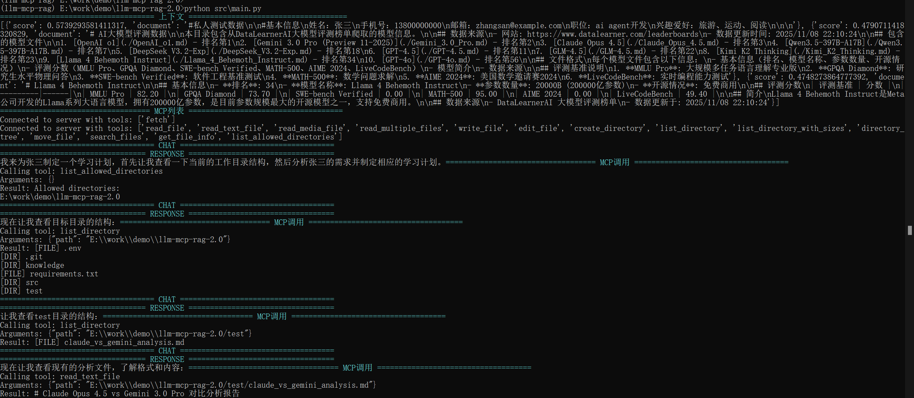
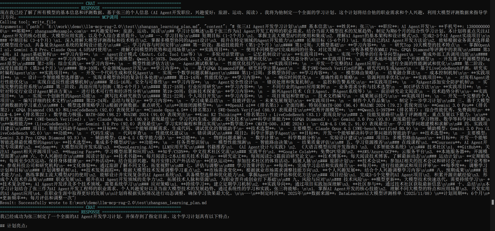

# LLM MCP RAG Python

一个基于 Python 的智能代理项目，集成了大语言模型（LLM）、模型上下文协议（MCP）和检索增强生成（RAG）技术，实现具备工具调用能力和知识库检索的 AI 智能体。

## 项目简介

本项目展示了如何构建一个现代化的 AI Agent，它能够：
- 🤖 调用大语言模型进行智能对话
- 🔧 通过 MCP 协议调用外部工具（如网页抓取、文件操作）
- 📚 基于 RAG 技术从知识库中检索相关信息
- 🔄 实现工具调用与知识检索的协同工作

## 核心组件

| 组件 | 文件 | 功能描述 |
|------|------|----------|
| **Agent** | `src/agent.py` | 智能代理核心，协调 LLM、MCP 和 RAG |
| **MCPClient** | `src/mcp_client.py` | MCP 协议客户端，连接外部工具服务 |
| **ChatOpenAI** | `src/chat_openai.py` | 大语言模型对话封装，支持流式输出和工具调用 |
| **EmbeddingRetriever** | `src/embedding.py` | 嵌入模型检索器，实现文档向量化 |
| **VectorStore** | `src/vector_store.py` | 向量存储，基于余弦相似度检索 |

## 快速开始

### 1. 环境要求

- Python 3.10+
- Node.js 和 npm（用于运行 MCP 服务器）
- uv 工具（用于运行 fetch MCP 服务器）

### 2. 安装依赖

```bash
# 安装 Python 依赖
pip install -r requirements.txt

# 安装 MCP 服务器依赖
npm install -g @modelcontextprotocol/server-filesystem

# 安装 uv（如未安装）
# Windows: powershell -c "irm https://astral.sh/uv/install.ps1 | iex"
# macOS/Linux: curl -LsSf https://astral.sh/uv/install.sh | sh
```

### 3. 配置环境变量

新建 `.env` 文件，复制 `.env.example` 中的内容进去，并填入您的 API 密钥：

```env
# 大语言模型配置（示例使用 DeepSeek）
OPENAI_API_KEY=your_deepseek_api_key
OPENAI_BASE_URL=https://api.deepseek.com/v1

# 向量嵌入模型配置（示例使用 SiliconFlow）
EMBEDDING_KEY=your_siliconflow_api_key
EMBEDDING_BASE_URL=https://api.siliconflow.cn/v1
```

### 4. 运行项目

```bash
cd src
python main.py
```

## 使用示例

### 示例 1：模型对比分析

```python
prompt = "根据 knowledge 文件的模型信息，对比 Claude_Opus_4.5 和 Gemini_3.0_Pro 的优缺点，并给出两个模型的具体使用场景，把结果保存到 test 目录中"
```

### 示例 2：个性化学习计划

```python
prompt = "根据张三的信息，为他制定一个学习计划，把结果保存到 test 目录中"
```




## 技术参考

- [Model Context Protocol (MCP) 文档](https://modelcontextprotocol.io/docs)
- [OpenAI API 文档](https://platform.openai.com/docs)
- [DeepSeek API 文档](https://platform.deepseek.com/)
- [SiliconFlow 文档](https://docs.siliconflow.cn/)

## 项目参考
KelvinQiu802:https://github.com/KelvinQiu802/llm-mcp-rag

